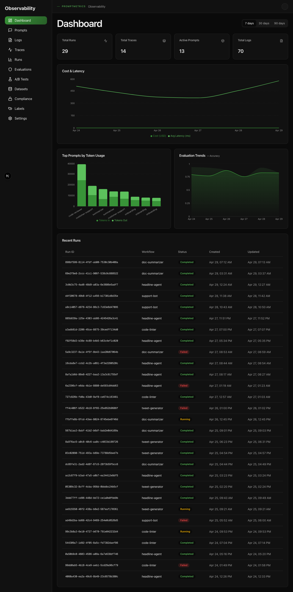
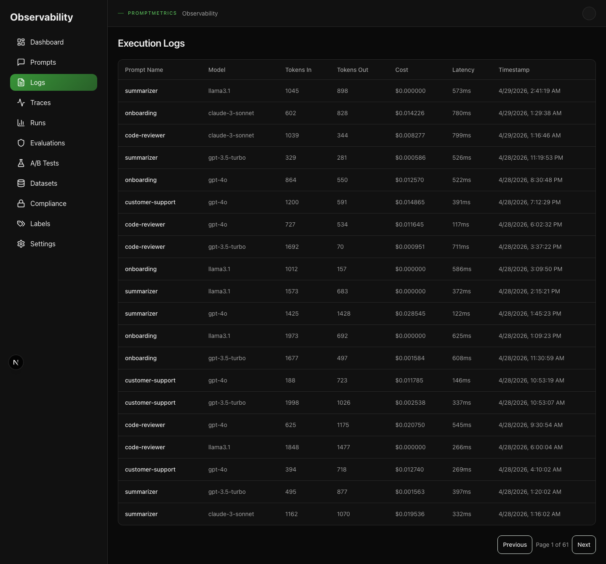
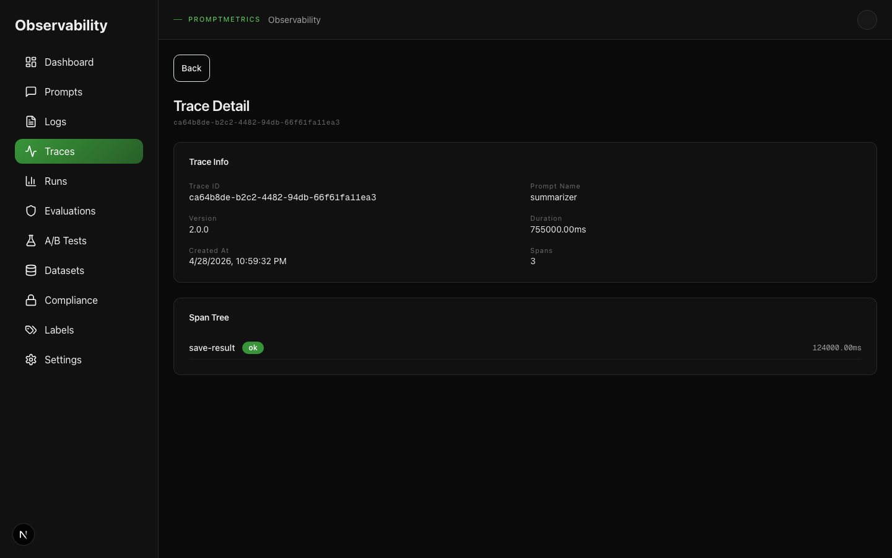
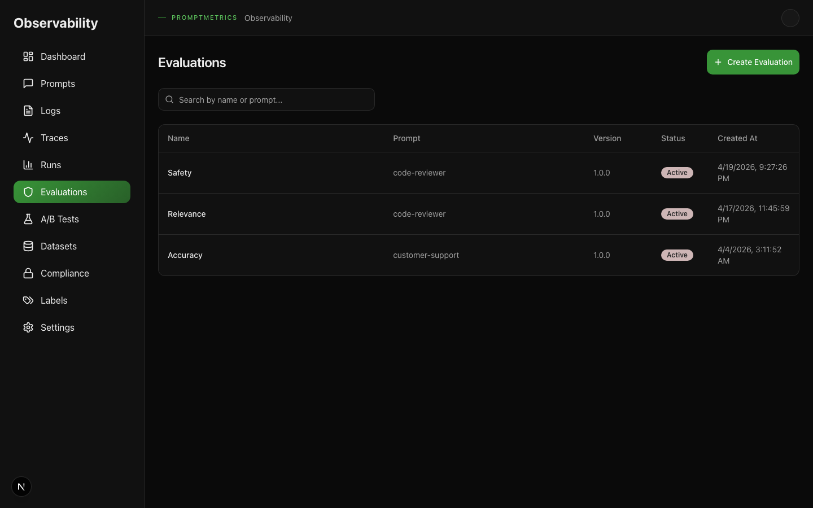

# PromptMetrics Dashboard

A Next.js observability UI for monitoring prompts, logs, traces, runs, evaluations, A/B tests, datasets, compliance, and the LLM playground.

---

## Table of Contents

- [Getting Started](#getting-started)
- [Authentication](#authentication)
- [Overview Page](#overview-page)
- [Logs Page](#logs-page)
- [Traces Page](#traces-page)
- [Evaluations Page](#evaluations-page)
- [Other Pages](#other-pages)
- [Workspace Switching](#workspace-switching)
- [Metrics API Reference](#metrics-api-reference)
- [Common Workflows](#common-workflows)
- [Architecture](#architecture)
- [Development](#development)

---

## Getting Started

The dashboard runs as a separate Next.js app in the `ui/` directory. It communicates with the PromptMetrics Express API on port 3000.

### Prerequisites

1. The PromptMetrics server must be running:
   ```bash
   npm run build
   npm start
   # or
   npm run dev
   ```

2. An API key must be configured. Generate one with:
   ```bash
   node dist/scripts/generate-api-key.js --workspace default read,write
   ```

3. (Optional) Seed demo data for a populated dashboard:
   ```bash
   node dist/scripts/seed-demo-data.js
   ```

### Start the UI

```bash
cd ui
npm install
npm run dev
```

Open [http://localhost:3000](http://localhost:3000) in your browser.

### Configure the API endpoint

The UI reads the API URL from the environment:

| Variable | Default | Description |
|----------|---------|-------------|
| `NEXT_PUBLIC_API_URL` | `""` (same origin) | Base URL of the PromptMetrics API |
| `NEXT_PUBLIC_DEMO_API_KEY` | — | Demo API key for read-only previews |

For production builds, set `NEXT_PUBLIC_API_URL` before building:

```bash
NEXT_PUBLIC_API_URL=http://localhost:3000 npm run build
```

---

## Authentication

On first load, the dashboard prompts for an API key. The key is stored in `sessionStorage` and sent as the `X-API-Key` header on every request.

To switch keys, clear `sessionStorage` and reload the page:

```javascript
sessionStorage.removeItem('pm-api-key');
location.reload();
```

---

## Overview Page

The Overview page (`/`) is the dashboard home. It surfaces the health of your LLM operations through summary cards, time-series charts, and recent activity.

### Summary Cards

At the top of the page, four cards show key metrics for the selected time window:

| Card | Metric | Source |
|------|--------|--------|
| **Total Runs** | Number of workflow runs | `runs` table |
| **Total Traces** | Number of agent traces | `traces` table |
| **Active Prompts** | Distinct prompts with `status = active` | `prompts` table |
| **Total Logs** | Number of execution logs | `logs` table |

Use the **7 days / 30 days / 90 days** tabs to change the time window. All cards and charts update together.

### Cost & Latency Chart

A time-series line chart showing:
- **Cost (USD)** — total `cost_usd` per day
- **Avg Latency (ms)** — mean `latency_ms` per day

Data is fetched from `GET /v1/metrics/time-series`. Days with zero data are omitted from the chart (the frontend does not fill gaps with zeros).

### Top Prompts by Token Usage

A bar chart ranking prompts by total tokens consumed (in + out). Each bar is stacked to show `tokens_in` and `tokens_out` separately. Data comes from `GET /v1/metrics/prompts`.

### Evaluation Trends

An area chart showing the average evaluation score over time for the first evaluation returned by `GET /v1/metrics/evaluations`. Click an evaluation on the Evaluations page to see its dedicated trend.

### Recent Runs

A table of the most recent workflow runs with columns:
- **Run ID** — UUID of the run
- **Workflow** — the `workflow_name`
- **Status** — `running`, `completed`, or `failed` (color-coded badge)
- **Created** — timestamp
- **Updated** — timestamp

---

## Logs Page

Navigate to **Logs** in the sidebar to view execution logs (`/logs`).

The table shows every logged LLM request:

| Column | Description |
|--------|-------------|
| **Prompt Name** | Which prompt was used |
| **Model** | LLM model (e.g., `gpt-4o`) |
| **Tokens In** | Input token count |
| **Tokens Out** | Output token count |
| **Cost** | Cost in USD |
| **Latency** | Response time in milliseconds |
| **Timestamp** | When the log was recorded |

Use the **Previous / Next** buttons to paginate. The page size is 20 rows.

---

## Traces Page

Navigate to **Traces** in the sidebar (`/traces`).

### Trace List

The list shows:
- **Trace ID** — click to open the detail page
- **Prompt Name** — the prompt associated with the trace
- **Version** — prompt version tag
- **Created At** — timestamp

### Trace Detail

Click a trace ID to open the detail page (`/traces/:trace_id`).

The detail view contains two sections:

1. **Trace Info** — metadata: trace ID, prompt name, version, total duration (computed from span start/end times), creation time, and span count.

2. **Span Tree** — a hierarchical view of all spans in the trace. Each span shows:
   - **Name** — e.g., `fetch-prompt`, `llm-call`, `parse-response`
   - **Status** — `ok` (green) or `error` (red)
   - **Duration** — computed from `start_time` and `end_time`
   - **Indentation** — child spans are indented under their parent

---

## Evaluations Page

Navigate to **Evaluations** in the sidebar (`/evaluations`).

### Evaluation List

The table shows all evaluations with columns:
- **Name** — evaluation name
- **Prompt** — associated prompt
- **Version** — prompt version tag
- **Status** — `Active` (has criteria) or `Draft`
- **Created At** — timestamp

Use the **search box** to filter by evaluation name or prompt name.

Click any row to open a **dialog** showing the evaluation's score trend chart over time.

### Score Trend Chart

The chart displays:
- **Avg Score** — mean score per day (line)
- **Min/Max Band** — shaded area between min and max scores per day
- **Tooltip** — shows `result_count` for each data point

Data comes from `GET /v1/metrics/evaluations?evaluation_id=N`.

---

## Other Pages

| Page | Route | Description |
|------|-------|-------------|
| **Prompts** | `/prompts` | List registered prompts; click a name to view versions |
| **Runs** | `/runs` | List workflow runs with status filters |
| **Labels** | `/labels` | Manage environment labels (`production`, `staging`, etc.) |
| **A/B Tests** | `/ab-tests` | Create and run A/B tests between prompt versions |
| **Datasets** | `/datasets` | Create datasets for evaluation runs |
| **Compliance** | `/compliance` | Scan prompts for PII, API keys, and sensitive data |
| **Playground** | `/playground` | Proxy LLM chat/completion calls through registered providers |
| **Settings** | `/settings` | API key input and workspace selector |

---

## Workspace Switching

PromptMetrics supports multi-tenancy via the `X-Workspace-Id` header. The dashboard stores the current workspace in `sessionStorage` under `pm-workspace` (default: `default`).

To switch workspaces:

1. Go to **Settings** (`/settings`).
2. Enter a new workspace ID in the workspace selector.
3. All subsequent API calls include the new `X-Workspace-Id` header.

**Important:** Data is isolated per workspace. Switching workspaces shows a completely different set of prompts, logs, traces, and runs.

---

## Metrics API Reference

The dashboard consumes four read-only metrics endpoints. All require `X-API-Key` and accept an optional `X-Workspace-Id`.

### `GET /v1/metrics/time-series`

Daily aggregated metrics.

**Query parameters:**
| Param | Type | Default | Description |
|-------|------|---------|-------------|
| `window` | `7d` \| `30d` \| `90d` | `7d` | Time window |

**Response:**
```json
{
  "window": "7d",
  "start": 1743638400,
  "end": 1746226800,
  "daily": [
    {
      "date": "2026-04-01",
      "request_count": 152,
      "total_tokens": 48200,
      "total_cost_usd": 12.34,
      "avg_latency_ms": 245,
      "p50_latency_ms": 180,
      "p95_latency_ms": 890,
      "error_rate": 0.013
    }
  ]
}
```

### `GET /v1/metrics/prompts`

Per-prompt usage breakdown.

**Query parameters:**
| Param | Type | Default | Description |
|-------|------|---------|-------------|
| `window` | `7d` \| `30d` \| `90d` | `7d` | Time window |
| `limit` | number | 20 | Max results (max 100) |

**Response:**
```json
{
  "window": "7d",
  "prompts": [
    {
      "prompt_name": "summarize",
      "version_tag": "v1.2",
      "request_count": 152,
      "total_tokens_in": 24000,
      "total_tokens_out": 24200,
      "total_cost_usd": 12.34,
      "avg_latency_ms": 245,
      "error_rate": 0.013
    }
  ]
}
```

Results are sorted by `total_cost_usd` descending.

### `GET /v1/metrics/evaluations`

Evaluation score trends.

**Query parameters:**
| Param | Type | Default | Description |
|-------|------|---------|-------------|
| `window` | `7d` \| `30d` \| `90d` | `7d` | Time window |
| `evaluation_id` | number | — | Filter to a single evaluation |

**Response:**
```json
{
  "window": "7d",
  "evaluations": [
    {
      "evaluation_id": 1,
      "name": "Factuality Check",
      "prompt_name": "summarize",
      "trend": [
        {
          "date": "2026-04-01",
          "avg_score": 4.2,
          "result_count": 12,
          "min_score": 3.0,
          "max_score": 5.0
        }
      ]
    }
  ]
}
```

### `GET /v1/metrics/activity`

Summary counts and recent runs.

**Query parameters:**
| Param | Type | Default | Description |
|-------|------|---------|-------------|
| `window` | `7d` \| `30d` | `7d` | Time window |
| `page` | number | 1 | Recent runs page |
| `limit` | number | 10 | Recent runs page size |

**Response:**
```json
{
  "window": "7d",
  "summary": {
    "total_runs": 482,
    "total_traces": 315,
    "total_logs": 1520,
    "total_evaluations": 42,
    "active_prompts": 12,
    "failed_runs": 18
  },
  "recent_runs": {
    "items": [...],
    "total": 482,
    "page": 1,
    "limit": 10,
    "totalPages": 49
  }
}
```

---

## Common Workflows

### Finding a Slow Prompt

1. Go to the **Overview** page.
2. Switch to the **30 days** window for a broader view.
3. Look at the **Cost & Latency** chart. Spikes in latency are visible as peaks.
4. Scroll to **Top Prompts by Token Usage**. High token counts often correlate with high latency.
5. For detailed per-request data, go to **Logs** and sort by the **Latency** column (click the header).

### Debugging a Failed Run

1. On the **Overview** page, check the **Total Runs** card. If the number is high, check the **Recent Runs** table below.
2. Look for rows with a red **failed** status badge.
3. Note the **Run ID** and **Workflow** name.
4. Go to **Runs** (`/runs`) and use the table to find the failed run. The run detail shows `input` and `output` JSON.
5. If the run has a `trace_id`, go to **Traces** and search for it to see the full span tree — the `error` status on a span often points to the exact step that failed.

### Comparing Evaluation Scores

1. Go to **Evaluations** (`/evaluations`).
2. Click any evaluation row to open the **Score Trend** dialog.
3. The chart shows average score over time with min/max bands. A downward trend indicates degrading prompt quality.
4. Switch between evaluations by clicking different rows — the dialog updates without leaving the page.
5. For a programmatic view, query `GET /v1/metrics/evaluations?window=30d` and compare `avg_score` across evaluations.

### Switching Between Production and Staging

1. Go to **Settings** (`/settings`).
2. Change the **Workspace ID** from `default` to `production` or `staging`.
3. The dashboard reloads with data scoped to the new workspace.
4. All summary cards, charts, and tables now reflect only that workspace's data.

---

## Architecture

```
┌─────────────┐      HTTP/JSON      ┌─────────────┐
│  Browser    │ ◄─────────────────► │  Next.js UI │  port 3000
│  (React 19) │                     │  (ui/)      │
└─────────────┘                     └──────┬──────┘
                                           │
                                    ┌──────┴──────┐
                                    │ Express API │  port 3000 (same-origin)
                                    │ (src/)      │
                                    └──────┬──────┘
                                           │
                                    ┌──────┴──────┐
                                    │ SQLite / PG │
                                    │ (metadata)  │
                                    └─────────────┘
```

The dashboard is a **consumer** of the existing backend. It does not modify write paths. All data flows through the same `X-API-Key` authentication and `X-Workspace-Id` tenant scoping as the REST API.

### State Management

- **TanStack Query** handles all server state (caching, deduplication, background refetching).
- **React `useState`** is used only for local UI state (pagination, modals, search input).
- Default stale time is 30 seconds. The dashboard refetches visible data when the window regains focus.

### Design System

- **Tailwind CSS v4** with custom `pm-*` tokens (`pm-bg`, `pm-surface`, `pm-brand`, etc.).
- **Recharts** for line, bar, and area charts.
- **Lucide React** for icons.
- Dark mode is the default.

---

## Development

### File Structure

```
ui/src/
├── app/
│   ├── page.tsx                 # Overview (dashboard home)
│   ├── logs/page.tsx            # Execution logs
│   ├── traces/page.tsx          # Trace list
│   ├── traces/[trace_id]/page.tsx  # Trace detail with span tree
│   ├── evaluations/page.tsx     # Evaluation list + trend dialog
│   ├── prompts/page.tsx         # Prompt list
│   ├── runs/page.tsx            # Run list
│   ├── settings/page.tsx        # API key + workspace
│   └── ...
├── components/
│   ├── layout/
│   │   ├── DashboardLayout.tsx  # Sidebar + top bar shell
│   │   ├── AdminSidebar.tsx     # Navigation rail
│   │   └── TopBar.tsx           # Workspace indicator
│   ├── charts/
│   │   ├── TimeSeriesChart.tsx  # Cost/latency line chart
│   │   ├── TokenBarChart.tsx    # Token usage bar chart
│   │   └── ScoreTrendChart.tsx  # Evaluation area chart
│   ├── data-display/
│   │   ├── SummaryCard.tsx      # Stat card
│   │   └── StatusBadge.tsx      # Run status badge
│   └── ui/                      # Primitives (Button, Card, Table, Skeleton, etc.)
├── lib/
│   ├── api.ts                   # REST client (all endpoints)
│   └── query-client.ts          # TanStack Query config
└── styles/
    └── globals.css              # pm-* tokens + Tailwind imports
```

### Running Tests

```bash
# E2E tests (requires backend running)
npx playwright test

# Unit tests (if configured)
npm test
```

### Building for Production

```bash
cd ui
NEXT_PUBLIC_API_URL=http://your-api-url npm run build
```

The static export is written to `ui/dist/` and can be served by any static file server, or the Next.js server can run directly:

```bash
npm start  # serves on port 3000
```

---

## Screenshots

### Overview Page



### Logs Page



### Trace Detail



### Evaluations Page



---

*For backend API documentation, see [`docs/api.md`](../docs/api.md).*
*For architecture details, see [`docs/architecture.md`](../docs/architecture.md).*
